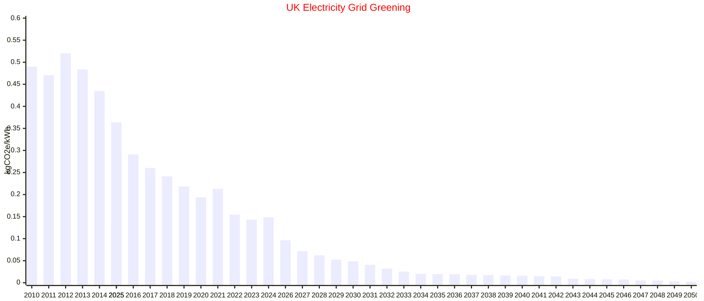

Here's a littel bit of mucking about to show how the UK Electricity grid has "Greened" over time. It is taking the data from UK grid predictions and from ONS actual data and I've plonked it into a standard mermaid graph. Once I find a prettier solution I'll add some other stats that i like to keep an eye on

 | Year | kgCO2e/kWh  |
|------|-------------|
| 2010 | 0.489616234 |
| 2011 | 0.47068806  |
| 2012 | 0.52004578  |
| 2013 | 0.483518529 |
| 2014 | 0.43447332  |
| 2015 | 0.363670279 |
| 2016 | 0.290885163 |
| 2017 | 0.260306767 |
| 2018 | 0.241334478 |
| 2019 | 0.218320716 |
| 2020 | 0.193766616 |
| 2021 | 0.212826641 |
| 2022 | 0.154721428 |
| 2023 | 0.143091135 |
| 2024 | 0.148730085 |
| 2025 | 0.129055494 |
| 2026 | 0.096387254 |
| 2027 | 0.071830956 |
| 2028 | 0.062258    |
| 2029 | 0.052597546 |
| 2030 | 0.048525623 |
| 2031 | 0.040770093 |
| 2032 | 0.032109307 |
| 2033 | 0.025484701 |
| 2034 | 0.020498765 |
| 2035 | 0.019773591 |
| 2036 | 0.019271319 |
| 2037 | 0.018001716 |
| 2038 | 0.017571283 |
| 2039 | 0.016518991 |
| 2040 | 0.015739137 |
| 2041 | 0.015003872 |
| 2042 | 0.014244448 |
| 2043 | 0.008964068 |
| 2044 | 0.00833157  |
| 2045 | 0.007745136 |
| 2046 | 0.007573948 |
| 2047 | 0.005233889 |
| 2048 | 0.005087561 |
| 2049 | 0.003225143 |
| 2050 | 0.00245518  |